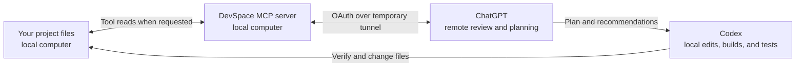

# Codex Bridge Desktop

Codex Bridge Desktop lets ChatGPT inspect a chosen local project and help plan coding work while Codex handles edits, builds, and tests on your computer. It is designed to reduce the amount of broad repository context sent through a Codex chat by routing those reviews through [codex-chatgpt-bridge](https://github.com/Zhenyu98/codex-chatgpt-bridge). This does **not** guarantee lower overall token usage, cost, or plan consumption: ChatGPT also uses your account's allowance, and the traffic figures in this app are estimates rather than measured Codex savings.

The app starts and stops a local [DevSpace](https://github.com/Waishnav/devspace) MCP server and a temporary Cloudflare Quick Tunnel. The public endpoint is **off by default**. Task routing is manual: you decide what ChatGPT reads and which suggestions Codex implements.

## How it works

Reading tools run on your computer; requested content passes through the tunnel to ChatGPT for review. Codex applies and verifies changes locally. The bridge does not automatically upload an entire project, but an authorized client can request file content or run shell commands. See the [actual security boundary](SECURITY.md#actual-boundary) before connecting it to a sensitive workspace.

> **Vibe-coded beta: use at your own risk.** This project was 100% vibe coded. It has had local checks and Windows, Ubuntu, and macOS CI builds, but that is not an independent security audit; the full Ubuntu and macOS tunnel lifecycle still needs native testing. Review the [security notes](SECURITY.md), [OpenAI's Terms of Use](https://openai.com/policies/terms-of-use/) and any other terms that apply to your ChatGPT/Codex account and connected services. You are responsible for deciding whether this workflow is permitted for your account and data.

## What is installed

| Platform | Build result | Control surface | Status |
| --- | --- | --- | --- |
| Windows 10/11 | Codex Bridge.exe and Kill Codex Bridge.exe | Notification-area tray and details window | Locally built and tested |
| Ubuntu | codex-bridge ELF and desktop launcher | Terminal menu and on/off/status commands | Native build passed CI; lifecycle needs Ubuntu testers |
| macOS | codex-bridge Mach-O and Codex Bridge.app launcher | Terminal menu and on/off/status commands | Native build passed CI; lifecycle needs macOS testers |

This repository contains no upstream binaries, credentials, browser sessions, personal workspace paths, or public tunnel URLs. It builds binaries on each user's machine. Runtime settings and credentials live outside this repository.

## Pinned dependencies

- [codex-chatgpt-bridge](https://github.com/Zhenyu98/codex-chatgpt-bridge), tag v0.3.0, commit 351c66fef0390872443af1587a978e6f76f479b8. The Windows installer clones and verifies this revision, then installs its skill. Windows scripts here are derived from that workflow; see [NOTICE.md](NOTICE.md).
- [DevSpace](https://github.com/Waishnav/devspace), npm package @waishnav/devspace version 1.0.2. The Windows installer refuses to silently downgrade a different global version. The Unix installer keeps this version under the user account without changing global npm packages.
- Node.js 20.12 through 26.x, npm, Git, and Cloudflare cloudflared.
- Windows build: Windows PowerShell 5.1 and the .NET Framework 4.x C# compiler.
- Ubuntu/macOS build: Python 3.10+ with venv and pip, plus pinned psutil and PyInstaller in [build-requirements.txt](unix/build-requirements.txt). macOS also uses built-in sips and iconutil.

The Windows controller can install a signed cloudflared binary on first On. For Ubuntu/macOS, install [cloudflared from Cloudflare](https://developers.cloudflare.com/cloudflare-one/connections/connect-networks/downloads/) before running the installer. A Quick Tunnel URL changes when the tunnel restarts; ChatGPT may need its MCP address updated.

## Install

### Windows

1. Install Node.js, Git, and npm. Check that the Node version is at least 20.12.
2. Download or clone this private repository.
3. Double-click [install.cmd](install.cmd). Enter **one narrow project folder** when prompted. It builds both EXEs, installs the pinned upstream skill and DevSpace if absent, and creates a Start menu shortcut.
4. Open **Codex Bridge** from Start. The bridge remains off until you choose **Turn on**.
5. Copy the displayed MCP address, ending in /mcp, to your own ChatGPT custom MCP connection. Follow the [connection walkthrough](docs/CONNECT.md) and the [official ChatGPT guide](https://developers.openai.com/plugins/deploy/connect-chatgpt). Keep the Owner password local. Test with a disposable, non-sensitive folder first.
6. Choose **Turn off** or **Exit** when finished. If stuck, run **Kill Codex Bridge** from the installed program folder.

The installer refuses drive roots, the entire user profile, and a directory containing the user profile. It sets upstream ProjectRoot and the sole AllowedRoots entry to the folder you chose.

### Ubuntu or macOS

1. Install Node.js, npm, Git, Python 3.10+ with venv and pip, and Cloudflare cloudflared.
2. Clone or download this repository. In Terminal, run: bash install.sh /absolute/path/to/one/project
3. Launch **Codex Bridge** from the desktop launcher, or run: ~/.local/bin/codex-bridge on
4. Run ~/.local/bin/codex-bridge status to see the current MCP URL and ~/.local/bin/codex-bridge off to stop it. Automatic turnoff defaults to one hour. Change it with: codex-bridge configure --root /absolute/path/to/project --auto-off 2h

The Unix controller uses its own DevSpace config directory under the user's XDG config directory. It does not read the person's existing DevSpace credentials. The upstream project's PowerShell skill is installed only on Windows; Unix currently controls DevSpace directly and Codex task routing remains manual. The Unix build uses a terminal menu; it does not yet provide a persistent colored system tray.

## Build without installing

- Windows: powershell.exe -NoProfile -ExecutionPolicy Bypass -File scripts\build-windows.ps1. Output: dist\windows.
- Ubuntu/macOS: bash scripts/build-unix.sh. Output: dist/ubuntu or dist/macos.
- Build outputs are ignored by Git. macOS output is unsigned and unnotarized; beta testers should build locally. Do not distribute it as a trusted signed app.

## Runtime behavior

- On starts DevSpace and a Quick Tunnel, checks local and public OAuth/MCP endpoints, and displays the current MCP URL.
- Off records intentional shutdown and stops managed processes. It does not revoke OAuth grants. After suspected unauthorized access, use bridge.cmd Rotate on Windows or codex-bridge rotate on Unix. Rotation clears persisted DevSpace OAuth state and changes the Owner password; reconnect ChatGPT afterward.
- Windows retries unexpected failures up to three times per healthy run within the selected auto-off window. Unix beta retries up to three times and may assign a new temporary URL.
- Traffic and token figures are rough estimates of tunnel bytes. They are not actual Codex usage or billing.
- Project content is accessed when an authorized client invokes tools, but shell access remains powerful. Read [SECURITY.md](SECURITY.md).

See [docs/TROUBLESHOOTING.md](docs/TROUBLESHOOTING.md) for recovery help, [docs/TESTING.md](docs/TESTING.md) for the smoke-test checklist and [docs/RELEASE.md](docs/RELEASE.md) for a staged cohort plan. Do not post Owner passwords, OAuth tokens, public URLs, or unredacted logs in GitHub issues.
